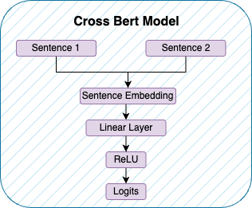
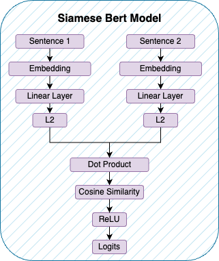

# Semantic Similarity

This repository contains an example of how to fine-tune a pretrained BERT model for semantic similarity.

## Introduction

The task is calculating the similarity between two sentences.
There are the examples of datasets:

```json
[
  {
    "name": "去苏州大学",
    "rewrite": "我要前往苏州大学。"
  },
  {
    "name": "用最新的两张照片制作GIF发送给张三",
    "rewrite": "向张三发送一份由最新的两张照片制作的GIF。"
  },
  {
    "name": "如果明天早上下雨的话帮我叫辆车去公司",
    "rewrite": "假若明天清晨降雨，敬请为我召来一辆车以便前往公司。"
  }
]
```

After the pre-processing, the dataset is split into training and testing sets.
There are the examples of training set.

| name               | rewrite                   | label |
|--------------------|---------------------------|:-----:|
| 去苏州大学              | 我要前往苏州大学                  |   1   |
| 去苏州大学              | 用最新的两张照片制作GIF发送给张三        |   0   |
| 如果明天早上下雨的话帮我叫辆车去公司 | 假若明天清晨降雨，敬请为我召来一辆车以便前往公司。 |   1   |

### Getting Started

```shell
# install the dependencies
python -m venv venv
pip install -r requirements.txt
# enter the working directory
cd src
# prepare the dataset
python dataset.py
# fine-tune the siamese model
python siamese/finetune.py
# fine-tune the cross model
python cross/finetune.py
# evaluate the model
python evaluator.py
```

## Background

### Cross Model

Cross-models are commonly employed in text classification tasks where it is necessary to determine whether two input
text segments belong to the same category. In this model structure, after encoding two text segments, they are
cross-combined and then subjected to subsequent classification predictions. Cross-models are relatively common in
classification tasks and typically only require a single BERT encoder.



### Siamese Model

Dual-tower Siamese models are commonly used in text similarity tasks, such as question answering and retrieval. This
model structure consists of two identical towers, each of which is a BERT encoder. They encode two text segments
separately. The encoded text representations are then compared using distance measurement methods (such as cosine
similarity) to calculate the similarity between the texts.



### Baseline Model

You can download baseline model
from [shibing624/text2vec-base-chinese](https://huggingface.co/shibing624/text2vec-base-chinese).

## Results
```
=============BaseLineModel=============
Evaluating: 100%|██████████| 80/80 [00:03<00:00, 23.52it/s]
Confusion Matrix:
[[43  0]
[ 3 34]]
Accuracy: 0.9625
===========CrossFineTuneModel===========
Evaluating: 100%|██████████| 80/80 [00:03<00:00, 25.91it/s]
Confusion Matrix:
[[42  1]
[ 0 37]]
Accuracy: 0.9875
==========SiameseFineTuneModel==========
Evaluating: 100%|██████████| 80/80 [00:05<00:00, 15.85it/s]
Confusion Matrix:
[[41  2]
[ 0 37]]
Accuracy: 0.975
```